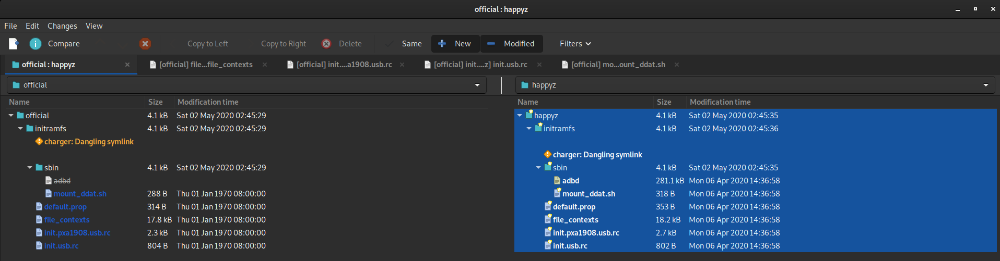
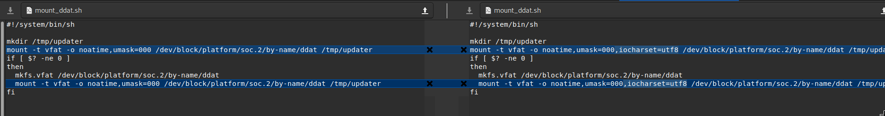
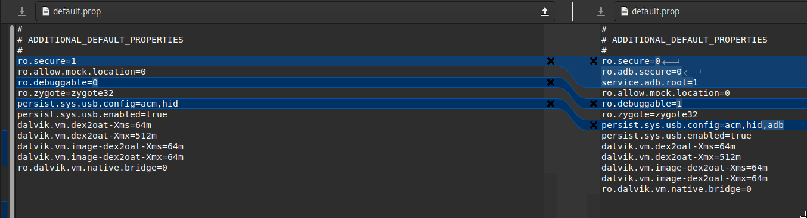
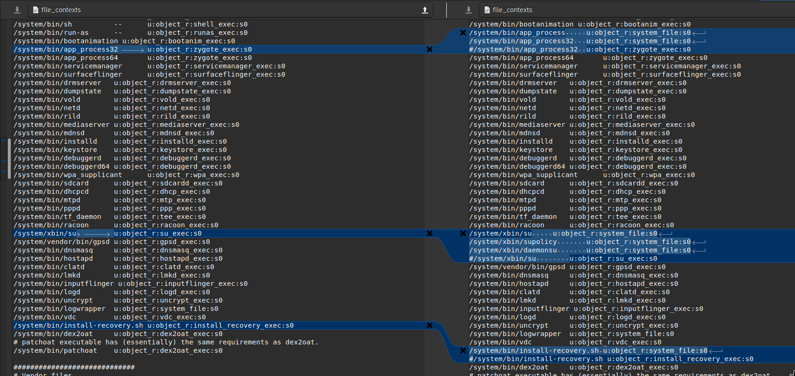
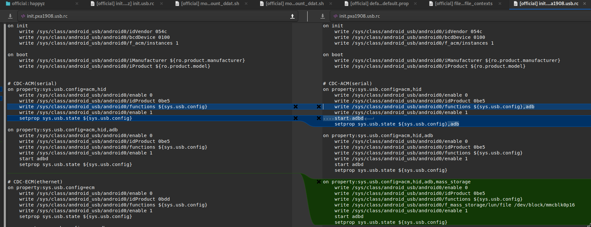
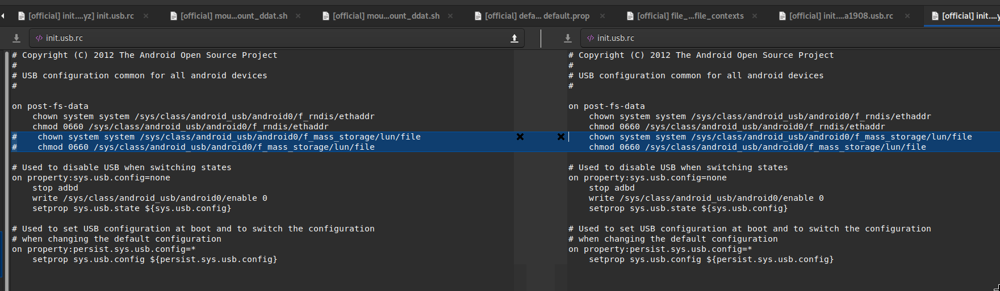

# Understanding the ADB activation process

This documentation attempts to find out ho ADB, the android debugger, can be re-activated on the DPT-RP1

## Source of information
HappyZ, the initial collector and creator of various rooting guide and tools, regularly
recreate bootimg files for each update, to re-activate various features, one of which being
the adb daemon. 

* His repository: https://github.com/HappyZ/dpt-tools
* His "Ultimate Guide": https://github.com/HappyZ/dpt-tools/wiki/The-Ultimate-Rooting-Guide

However, while most of his tricks are reversible easily, he has not uploaded nor documented
anything around the boot "mod" he manually creates each release.

Being wary of random img files, let's see what happened there, and how he activated adb.

## Unpacking the official and happyz img to compare
This repository contains tools at tools/bootimg to help reverse happyz process.

1. Download the 1.6.50.14130 pkg from both Sony and Happyz (https://github.com/HappyZ/dpt-tools/blob/6a5c0e582ecb7597d3750d11844f17bedd06cf5b/fw_updater_packer_unpacker/pkg_example/flashable_mod_boot_img_1.6.50.14130/FwUpdater.pkg)
2. Unpack the boot.img from Sony's pkg:
```bash
dpt unpack /home/<user>/1.6.50.14130/FwUpdater.pkg /home/<user>/1.6.50.14130/
>
Unpacked data to /home/<user>/1.6.50.14130/decryptedData.tar.gz
Unpacked animation to /home/<user>/1.6.50.14130/decryptedAnimation.tar.gz

tar -xvf /home/<user>/1.6.50.14130/decryptedData.tar.gz
> File will be at FwUpdater/boot.img
```
3. Decompress both img files:
```bash
cd /tools/bootimg/
./unpack.sh bootimg.img ./official
./unpack.sh boot-1.6.50.14130-mod-200405-233932.img ./happyz
```
  * NOTE: This unpack script uses a linux-only closed-source unpacker for the 
img file, it was the first I tried, the developper is `Mikael Q Kuisma <kuisma@ping.se>`
and a quick reversing on https://onlinedisassembler.com/static/home/index.html didn't show 
anything suspicious. Repacking Happyz img with it produces the same file, so I trust it. Alternatives welcome.

4. Diff the folders:
```bash
./diff.sh official happyz
>
Files official/initramfs/default.prop and happyz/initramfs/default.prop differ
Files official/initramfs/file_contexts and happyz/initramfs/file_contexts differ
Files official/initramfs/init.pxa1908.usb.rc and happyz/initramfs/init.pxa1908.usb.rc differ
Files official/initramfs/init.usb.rc and happyz/initramfs/init.usb.rc differ
Only in happyz/initramfs/sbin: adbd
Files official/initramfs/sbin/mount_ddat.sh and happyz/initramfs/sbin/mount_ddat.sh differ
```
We can see here that happyz:
* Added the adb daemon process (how did he get it compiled for arm ?)
* Modified 5 config files to start using it

4. Compare each file with meld

Meld is an interesting linux-only folder comparer:
```bash
sudo apt install meld
``` 


* mountddat.sh

```bash
diff official/initramfs/sbin/mount_ddat.sh  happyz/initramfs/sbin/mount_ddat.sh  
4c4
< mount -t vfat -o noatime,umask=000 /dev/block/platform/soc.2/by-name/ddat /tmp/updater
---
> mount -t vfat -o noatime,umask=000,iocharset=utf8 /dev/block/platform/soc.2/by-name/ddat /tmp/updater
8c8
<   mount -t vfat -o noatime,umask=000 /dev/block/platform/soc.2/by-name/ddat /tmp/updater
---
>   mount -t vfat -o noatime,umask=000,iocharset=utf8 /dev/block/platform/soc.2/by-name/ddat /tmp/updater
```
* default.prop

```bash
diff official/initramfs/default.prop happyz/initramfs/default.prop
4c4,6
< ro.secure=1
---
> ro.secure=0
> ro.adb.secure=0
> service.adb.root=1
6c8
< ro.debuggable=0
---
> ro.debuggable=1
8c10
< persist.sys.usb.config=acm,hid
---
> persist.sys.usb.config=acm,hid,adb
```

* file_contexts

```bash
diff official/initramfs/file_contexts happyz/initramfs/file_contexts
130c130,132
< /system/bin/app_process32     u:object_r:zygote_exec:s0
---
> /system/bin/app_process     u:object_r:system_file:s0
> /system/bin/app_process32   u:object_r:system_file:s0
> #/system/bin/app_process32  u:object_r:zygote_exec:s0
152c154,157
< /system/xbin/su               u:object_r:su_exec:s0
---
> /system/xbin/su     u:object_r:system_file:s0
> /system/xbin/supolicy       u:object_r:system_file:s0
> /system/xbin/daemonsu       u:object_r:system_file:s0
> #/system/xbin/su        u:object_r:su_exec:s0
163c168,169
< /system/bin/install-recovery.sh u:object_r:install_recovery_exec:s0
---
> /system/bin/install-recovery.sh u:object_r:system_file:s0
> #/system/bin/install-recovery.sh u:object_r:install_recovery_exec:s0
```
These basically give root permission to the android process spawner `app_process32`

* init.pxa1908.usb.rc

```bash
diff official/initramfs/init.pxa1908.usb.rc happyz/initramfs/init.pxa1908.usb.rc
15c15
<     write /sys/class/android_usb/android0/functions ${sys.usb.config}
---
>     write /sys/class/android_usb/android0/functions ${sys.usb.config},adb
17c17,18
<     setprop sys.usb.state ${sys.usb.config}
---
>     start adbd
>     setprop sys.usb.state ${sys.usb.config},adb
26a28,35
> on property:sys.usb.config=acm,hid,adb,mass_storage
>     write /sys/class/android_usb/android0/enable 0
>     write /sys/class/android_usb/android0/idProduct 0be5
>     write /sys/class/android_usb/android0/functions ${sys.usb.config}
>     write /sys/class/android_usb/android0/f_mass_storage/lun/file /dev/block/mmcblk0p16
>     write /sys/class/android_usb/android0/enable 1
>     start adbd
>     setprop sys.usb.state ${sys.usb.config}
```

* init.usb.rc 

```bash
diff official/initramfs/init.usb.rc happyz/initramfs/init.usb.rc
9,10c9,10
< #    chown system system /sys/class/android_usb/android0/f_mass_storage/lun/file
< #    chmod 0660 /sys/class/android_usb/android0/f_mass_storage/lun/file
---
>     chown system system /sys/class/android_usb/android0/f_mass_storage/lun/file
>     chmod 0660 /sys/class/android_usb/android0/f_mass_storage/lun/file
```

## Remaining questions
* How did HappyZ get the adb binary
* Why isn't it automatically integrated into the root package
  * Because since the boot.img can change across version, if we want the root package to be 
  universally compatible, we can't integrate it. We could downloand, unpack the pkg, unpack the img, patch and repack all
  but it's more convenient to distribute the img in a self-signed pkg after the root.
* What are zygote vs system_file configurations
  * Zygote is the android user-space process spawner, which controls and enforces permissions. Replacing
  it with the system_file stanza must give root access to all processes  