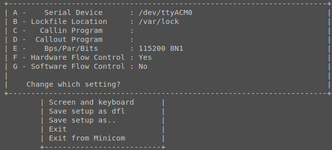
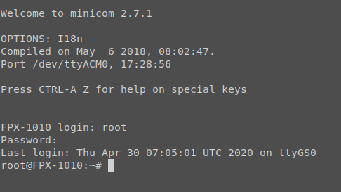

# Map to navigate the diagnosis mode
## Turning it on (after rooting)
1. Long press home, then power, wait a bit then release both buttons
2. Once the screen display 3 rectangle and a square, plug the USB cable

## Linux tty connection
- The device name on debian 10 is `dev/ttyACM0`
- It's possible to find the latest plugged USB devices like this
```
debian:~$ sudo dmesg | grep Sony -A 10 -B 1
>
[11417.097619] usb 1-7: new high-speed USB device number 10 using xhci_hcd
[11417.118968] usb 1-7: New USB device found, idVendor=054c, idProduct=0bdb, bcdDevice= 1.00
[11417.118969] usb 1-7: New USB device strings: Mfr=2, Product=3, SerialNumber=4
[11417.118970] usb 1-7: Product: FPX-1010
[11417.118970] usb 1-7: Manufacturer: Sony
[11417.118971] usb 1-7: SerialNumber: 0
[11417.121100] cdc_acm 1-7:1.0: ttyACM0: USB ACM device
[11417.121766] usb-storage 1-7:1.2: USB Mass Storage device detected
[11417.122009] scsi host6: usb-storage 1-7:1.2
[11418.134290] scsi 6:0:0:0: Direct-Access     Linux    File-CD Gadget   0314 PQ: 0 ANSI: 2
[11418.134478] scsi 6:0:0:0: Attached scsi generic sg3 type 0
[11418.134922] sd 6:0:0:0: Power-on or device reset occurred
[11418.158585] sd 6:0:0:0: [sdc] Attached SCSI removable disk

```

* A good application to connect to the serial port is `minicom`
    * Configure via `sudo minicom -s` and choose `Serial port setup` then press `A` to configure the Serial Device

    * Launch with `sudo minicom` and it will automatically open a channel to the diag mode

## Logging in
* Press enter, to "poke" the serial port and trigger the login/password routine
* Username: root, Password: 12345
* You're logged in if you see `root@FPX-1010:~#`


## Mounting the various devices
* 3 important block devices:
    * /dev/mmcblk0p8 : System partition, contains the software
    * /dev/mmcblk0p15 : Boot partition, same as the diag mode, already mounted on /
    * /dev/mmcblk0p16 : Mass storage, can be use to temporarily store stuff

You can run this to mount everything in one go:
```bash
cd /tmp
mkdir /tmp/sd
mkdir /tmp/system
mount /dev/mmcblk0p8 system
mount /dev/mmcblk0p16 sd 
```    

We can check:
```bash
root@FPX-1010:/usr/local/bin# cat /proc/mounts 
>
rootfs / rootfs rw 0 0
sysfs /sys sysfs rw,nosuid,nodev,noexec,relatime 0 0
proc /proc proc rw,nosuid,nodev,noexec,relatime 0 0
udev /dev devtmpfs rw,relatime,size=975944k,nr_inodes=160293,mode=755 0 0
devpts /dev/pts devpts rw,nosuid,noexec,relatime,gid=5,mode=620 0 0
/dev/root / ext4 rw,relatime,norecovery 0 0
selinuxfs /sys/fs/selinux selinuxfs rw,relatime 0 0
tmpfs /tmp tmpfs rw,relatime 0 0
/dev/mmcblk0p9 /tmp/system ext4 rw,relatime,data=ordered 0 0
/dev/mmcblk0p15 /tmp/root ext4 rw,relatime,norecovery 0 0
/dev/mmcblk0p16 /tmp/sd vfat ro,relatime,fmask=0022,dmask=0022,codepage=437,iocharset=iso8859-1,shortname=mixed,utf8,errors=remount-ro 0 0

```

## Interesting places
* Location of Sony APKs
```bash
root@FPX-1010:/tmp/system/app# ls
ActionExecutor                EbookNoteCreator
ActionSenderService           EbookTestMode
AppLauncher                   FolderList
ApplicationGateway            HTMLViewer
Bluetooth                     KeyChain
Browser                       LockManager
CaptivePortalLogin            MigrationManager
CertInstaller                 NetworkManager
ChineseIME                    NfcNci
ContentManager                NoteList
DCSSConnectionManagerService  PacProcessor
DPHostCardEmulator            PackageInstaller
DPSettings                    PolarisIME
DPUpdater                     PowerGadget
DataAccessProvider            ResourceMutex
DigitalPaperApp               SoundRecorder
DocumentList                  USBDeviceSwitcher
DocumentManager               UserDictionaryProvider
DocumentsUI                   iWnnIME
DownloadProviderUi            webview
Dpcif
```

* Location of Sony scripts (update, etc - notice the _bak files created during the root process)
```bash
root@FPX-1010:/usr/local/bin# ls
change_boot_mode.sh         rawdata
cpldctl                     rtc.sh
cpldupdater.sh              serial_number.sh
device_id.sh                set_sync_freq
devmem2                     sku_name.sh
dhw_params_write            sp1_params_write
diag_functions              start_eufwupdater.sh
diag_functions_bak          start_eufwupdater.sh_bak
epd_check.sh                start_prepare_animation.sh
epd_fb_test                 storage_functions
epd_params_write            swf_write
extract_sparse_file         touchpanel_test
factory_reset.sh            touchpanel_tune_data
factory_start.sh            tp_check.sh
factory_step_id.sh          tp_check_pen.sh
factory_step_id_clear.sh    tp_check_pen_sboff.sh
fix_partitions.sh           tp_check_pen_sbon.sh
fixgpt.sh                   tp_get_cal_table_data.sh
format_userdata.sh          tp_print_touch_data.sh
get_batt_level.sh           tp_read_config.sh
get_sync_freq               tp_read_reg.sh
gpio.sh                     tp_selftest.sh
jed2bin                     tp_version.sh
key_check.sh                tp_write_config.sh
keyscan                     tp_write_reg.sh
make_ext4fs                 updater_check.sh
mass_storage                updater_check.sh_bak
mass_storage.sh             updater_check_usbmem.sh
memtester                   usb_charge.sh
mfgbridge                   usb_target.sh
mfgbridge.sh                vcom_get.sh
mlanutl                     vcom_set.sh
msleep                      version_check.sh
nfc_params                  voltage.sh
nfc_send_cmd                wac_startup
nfc_set_parameters.sh       waveform_write
pastlog                     wifi_mac_address.sh
product_name.sh             wireless_functions
```

## Downloading a file
* PC to Diag mode: /dev/ttyACM0
* Diag mode to PC: /dev/ttyGS0

Minicom isn't so easy to use when it comes to dumping files from the DPT:
```bash
          Host side                |             Remote side
                                   |
                                   |    #Encode to base64
                                   |    cat file | base64 > file_b64
                                   |
                                   |    #Send after timeout
                                   |    (sleep 10; cat file_b64 > /dev/ttyS0) &
                                   |
       #############################################################
       ### Exit minicom but keep configuration (ctrlA-Z, then Q) ###
       #############################################################
                                   |
#Receive file                      |
cat < /dev/ttyUSB0 > file_b64      |
                                   |
#Decode file                       |
cat file_b64 | base64 -di > file   |

```
* The idea of this example (https://unix.stackexchange.com/questions/460342/retrieve-file-over-serial-without-kermit-and-lrzsz)
would have been do delay-trigger a file print on the diag-to-pc tty interface, quitting rapidly minicom, then
cat-ing the pc-to-diag tty for bytes. 

* Java however can handle it better: indeed it's not bothered by display concern, and can just spit whatever output
a command produces. Therefore, you can use the dpt tool in this repository:
```bash
dpt diag fetch /path/to/remote/file /path/to/local/file
```

## Decompiling Sony's APK
* Explain how to
### App launcher
### Document Manager
### Digital Paper App
